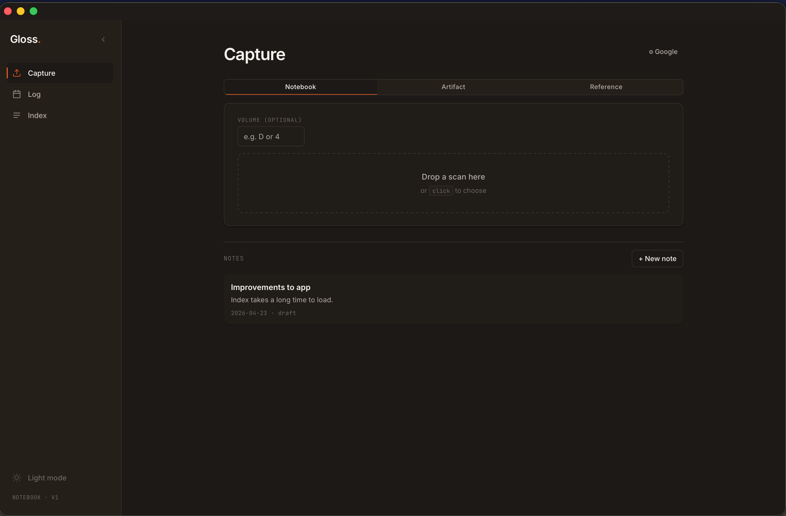
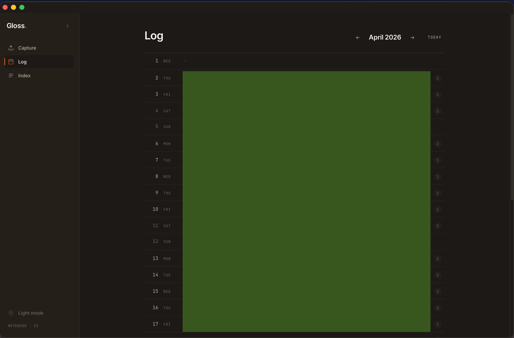
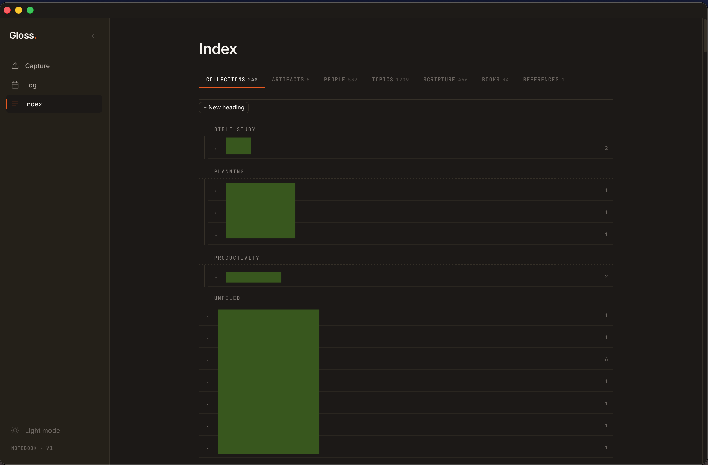

# Gloss

A single-user, local-first companion to a paper bullet journal.

You scan notebook spreads (images or multi-page PDFs) or paste voice-memo transcripts. Gloss uses Gemini to parse each logical page into structured entries — entities, collections, scripture references, people — and gives you a searchable, threaded index of everything you've written by hand.

Nothing stored in Gloss quotes your prose verbatim. Every entry is a pointer-summary back to the scan.

---

## Surfaces

### Capture
Upload scans (images or PDFs) or transcripts. Gloss parses each logical page into entities, collections, and references.



### Log
Calendar view of your notebook entries, organized by date. Click any day to see the pages you captured.



### Index
Browse collections, people, topics, scripture references, books, artifacts, and references. All auto-indexed and linked from your scans.



---

## Stack

- **Server:** Node.js + Express
- **Database:** SQLite via `better-sqlite3` (WAL + FTS5)
- **AI:** Google Gemini (`gemini-2.5-pro` for parse, `gemini-2.5-flash` for probe/chat)
- **Frontend:** Single vanilla-JS file (`public/index.html`) — no framework, no build step
- **PDF rendering:** Poppler (`pdftoppm` + `pdfinfo`)

---

## Prerequisites

- Node.js 20+
- [Poppler](https://poppler.freedesktop.org/) — `pdftoppm` and `pdfinfo` must be on PATH
  - macOS: `brew install poppler`
- A [Gemini API key](https://aistudio.google.com/apikey)

---

## Setup

```bash
git clone <repo-url>
cd gloss
npm install
cp .env.example .env
# Edit .env and set GEMINI_API_KEY
npm run dev
```

The server starts on port 3747 (or `PORT` from `.env`). The `data/` directory (database, scans, uploads) is created automatically on first run.

---

## Configuration

See [`.env.example`](.env.example) for all options. Required:

| Variable | Description |
|---|---|
| `GEMINI_API_KEY` | Required. Powers all parse, reexamine, and chat calls. |
| `PORT` | Optional. Defaults to `3747`. |
| `GOOGLE_OAUTH_CLIENT_JSON` | Optional. Path to OAuth client JSON for Google Docs/Drive content fetch on artifacts and references. |

---

## One-shot seed scripts

Run these once on a fresh database (start the server first so the DB file is created):

```bash
node seed-compass.js               # Weekly Compass values + long-range commitments
node scripts/seed_roles_volume.js  # Roles/Areas entities + Volume D page tags
node scripts/seed_compass_planning.js  # Planning hub: mission, habits, relationships
```

All three are idempotent — safe to re-run.

---

## Project layout

```
server.js          HTTP server, ingest pipeline, chat assistant, planning hub
db.js              Schema + every data function (no ORM)
ai.js              Gemini calls (parse / reexamine / voice / probe / chat)
google.js          OAuth + Google Docs/Drive text export
public/index.html  Entire frontend (one file)
seed-compass.js    One-shot seed script
scripts/           Additional one-shot utilities
data/              Created at runtime — database, scans, uploads (gitignored)
```

---

## Ingest

Drop a scan (JPEG/PNG or PDF) or paste a voice-memo transcript through the UI. The pipeline:

1. PDF pages are rendered to PNG via `pdftoppm` at 220 dpi
2. Each page is probed cheaply for headers and page numbers
3. `gemini-2.5-pro` parses each logical page into structured entries
4. Entities (people, topics, scripture, collections) are upserted and linked
5. Threading markers (`continued from / to`) are detected and applied
6. Auto-classification files pages into any matching user indexes

---

## License

Private.
